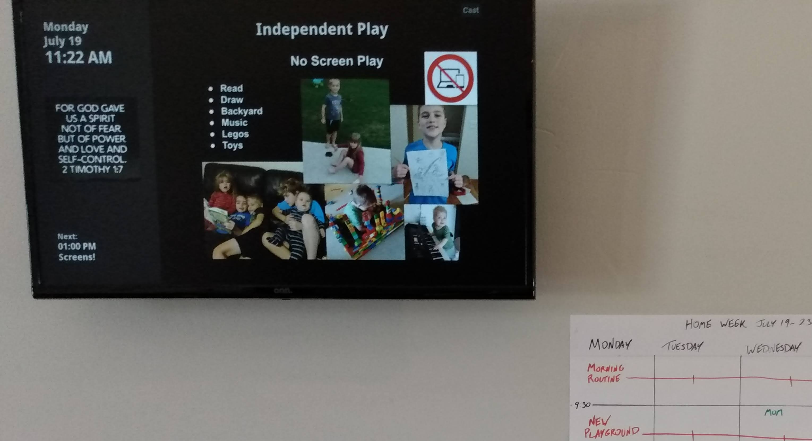

# Routiner
Display your routines on any TV or monitor by casting from any device (like a phone). No persistent hardware needed (other than cast receiver on the display), and all software is free. Once you start casting, you can remove the casting phone and the screen will keep showing the routine.

This project is a framework of hacks that you can use as a wholesale template, or remix into anything that fits the concept: **screencast an iframe whose source page changes on a schedule.**

Here's an example of how I use it for my fam with a Chromecast on a cheap monitor on the wall:

You can try my version at https://briandherbert.github.io/routiner  Note that there's an intentional 4 second delay in the cast receiver to initialize it.

You'll need:
- A *published* Google Sheet with your schedule (free)
- Google Slides of your routines (free)
- A place to host your site (free with GitHub Pages)
- A screen that can be casted to (most modern TVs)
- Put your url in the CAST_URL variable in sender.html: `const CAST_URL = "YOUR_URL.com"`

In the Sheet, make a schedule of webpages to show, like "at 1pm on Fridays, show webpage xyz.com". Example: https://docs.google.com/spreadsheets/d/1_dIMHuBOkZdQ08XwRWkF5KZvlkm5hmRB8TaKQ_SpA5A

Google Slides is an ideal way to make the source webpages, since each slide gets its own page, it's easy to arrange images and text, and you can manage pages in one place. For my family, I have a "Get ready for school slide" that's set up for 7:30am on weekdays, and a "Start Bedtime" slide that's set up for 8:20pm every day. Here's that slideshow: https://docs.google.com/presentation/d/1hM4JnnS_9ZbxVihTY1vbu_O0jB_0rEp1dLaPti79Hvs/edit#slide=id.gd460e50c57_0_128

You can disable slides in the google sheet with a '-' in the days column (e.g. disable "School Mornings" for summer). You can also specify a date with MM/DD to take over the schedule (e.g. "Christmas!").

## How It Works

The only magic is in how the casting is done - there must be a separate file included in an iframe in the main page (sender.html), and a 'disconnect' is faked on the caster to make the receiver stick on the page. The casting is optional; you could just run the site on a device.

The application reads data from a Google Spreadsheet published as CSV:
- Spreadsheet URL: https://docs.google.com/spreadsheets/d/1_dIMHuBOkZdQ08XwRWkF5KZvlkm5hmRB8TaKQ_SpA5A/pub?output=csv
- The spreadsheet contains columns for:
  - Name: The name of the routine
  - Days: When the routine applies (e.g., "week" for weekdays, "wkend" for weekends, "all" for every day, or specific days like "mo,tu,we")
  - Time: When the routine starts (e.g., "8:00 AM")
  - URL: Link to content to display (typically Google Slides)

### Operations
1. Fetches routine data from a Google Spreadsheet
2. Determines the current applicable routine based on the current day and time
3. Displays the routine content in an iframe
4. Shows the next upcoming routine in left sidebar
5. Includes Google Cast functionality for displaying on Chromecast devices

### Important: Publishing Your Google Sheet

For this application to work correctly, your Google Sheet **must** be published to the web:

1. In your Google Sheet, go to File > Share > Publish to web
2. Under "Link", select the sheet you want to share
3. For "Publish content as", select "Comma-separated values (.csv)"
4. Click "Publish" and copy the URL
5. The URL should end with "/pub?output=csv" - this is required for the application to fetch the data

This publishing step is critical because:
- It makes your data accessible without authentication
- It provides the data in CSV format that the application can parse
- It avoids CORS (Cross-Origin Resource Sharing) issues that would prevent data loading on some devices

Note that any changes to your published Google Sheet may take a few minutes to be reflected in the application.

### Special Features

- **Day Parsing**: Supports various day formats including:
  - "week" (Monday-Friday)
  - "wkend" (Saturday-Sunday)
  - "all" (every day)
  - Day abbreviations (e.g., "mo,tu,we" or "su")
  
- **Special Days**: Supports special dates in "mm/dd" format that override regular routines

- **Sidebar Content**: A special "sidebar" entry can be used to display content in the left sidebar's iframe

- **Sound Notifications**: Optional sound alerts when routines change (won't work on casted devices)

## Future
There's a ton of opportunity to remix and extend this. It's a quick and cheap way to do restaurant menus, waiting room signage, bulletin boards, billboards of rotating ads, etc. 
If the display screen has a problem, any phone or computer can be used to cast the content again.
The code strategy here would work with any kind of schedule (hard coded, Airtable, CSV) and set of sites.