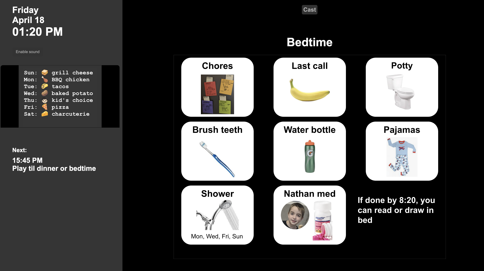

# Routines Dashboard

Display your routines on any TV or monitor by casting from any device, then disconnecting. No persistent hardware needed (other than cast receiver on the display), and it's FREE.

You'll make a schedule of webpages to show, like "at 1pm on Fridays, show webpage xyz.com". This schedule will live in a Google Sheet you create; see my example here: https://docs.google.com/spreadsheets/d/1_dIMHuBOkZdQ08XwRWkF5KZvlkm5hmRB8TaKQ_SpA5A

Google Sheets is an ideal way to make these webpages, since each slide gets its own page. For my family, I have a "Get ready for school slide" that's set up for 7:30am on weekdays, and a "Start Bedtime" slide that's set up for 8:20pm every day. Here's that slideshow: https://docs.google.com/presentation/d/1hM4JnnS_9ZbxVihTY1vbu_O0jB_0rEp1dLaPti79Hvs/edit#slide=id.gd460e50c57_0_128

You can tack on a slide when you need a new routine, paste in photos, and you can disable slides in the google sheet with a '-'. When school is out, just put a '-' in the days column for school routines. Note that I sometimes have work-in-progress images off to the side that won't show up until I move them onto the slide.

## Overview

This application serves as a digital routine display system that:

1. Fetches routine data from a Google Spreadsheet
2. Determines the current applicable routine based on the current day and time
3. Displays the routine content in an iframe
4. Shows the next upcoming routine
5. Supports special dates (like holidays or specific events)
6. Includes Google Cast functionality for displaying on Chromecast devices

## How It Works

### Data Source

The application reads data from a Google Spreadsheet published as CSV:
- Spreadsheet URL: https://docs.google.com/spreadsheets/d/1_dIMHuBOkZdQ08XwRWkF5KZvlkm5hmRB8TaKQ_SpA5A/pub?output=csv
- The spreadsheet contains columns for:
  - Name: The name of the routine
  - Days: When the routine applies (e.g., "week" for weekdays, "wkend" for weekends, "all" for every day, or specific days like "mo,tu,we")
  - Time: When the routine starts (e.g., "8:00 AM")
  - URL: Link to content to display (typically Google Slides)

### Important: Publishing Your Google Sheet

For this application to work correctly, your Google Sheet **must** be published to the web:

1. In your Google Sheet, go to File > Share > Publish to web
2. Under "Link", select the sheet you want to share
3. For "Publish content as", select "Comma-separated values (.csv)"
4. Click "Publish" and copy the URL
5. The URL should end with "/pub?output=csv" - this is required for the application to fetch the data

This publishing step is critical because:
- It makes your data accessible without authentication
- It provides the data in CSV format that the application can parse
- It avoids CORS (Cross-Origin Resource Sharing) issues that would prevent data loading on some devices

Note that any changes to your published Google Sheet may take a few minutes to be reflected in the application.

### Special Features

- **Day Parsing**: Supports various day formats including:
  - "week" (Monday-Friday)
  - "wkend" (Saturday-Sunday)
  - "all" (every day)
  - Day abbreviations (e.g., "mo,tu,we" or "su")
  
- **Special Days**: Supports special dates in "mm/dd" format that override regular routines

- **Sidebar Content**: A special "sidebar" entry can be used to display content in the left sidebar

- **Sound Notifications**: Optional sound alerts when routines change (requires user activation)

- **Chromecast Support**: Includes Google Cast functionality via the sender.html file

### Layout

The application has a two-column layout:
- Left column: Shows current date/time, next routine information, and optional sidebar content
- Right column: Displays the current routine name and its associated content in an iframe

## Technical Implementation

- Pure HTML, CSS, and JavaScript (no framework dependencies)
- Uses XMLHttpRequest to fetch CSV data from Google Sheets
- Parses and sorts routines by day and time
- Updates display every minute to check for routine changes
- Uses Google Cast API for Chromecast integration

## Usage

1. Set up a Google Spreadsheet with the following columns:
   - Name: Routine name
   - Days: When the routine applies
   - Time: When the routine starts
   - URL: Content to display (typically Google Slides)

2. Publish the spreadsheet to the web as CSV

3. The application will automatically:
   - Load the latest data
   - Display the current applicable routine
   - Update as time progresses

## Deployment

This is a static web application hosted on GitHub Pages at:
https://briandherbert.github.io/

## Chromecast Implementation

The application includes Chromecast support to display routines on any TV or monitor with a Chromecast device. This implementation has some specific requirements to function correctly:

### Key Components

- **Separate Sender File**: The casting functionality is intentionally isolated in `sender.html` that is included as an iframe in the main application.

- **Application ID**: Uses a specific application ID (`5CB45E5A`) that works with a custom URL Cast Receiver.

- **Cast URL**: The application must cast the URL where the site is hosted (e.g., `https://briandherbert.github.io/`) to the Chromecast device.

- **Communication Protocol**: Uses the `urn:x-cast:com.url.cast` namespace for messaging with the receiver.

### Important Implementation Details

1. **URL Matching Strategy**: When reusing this for your own dashboard, you must set the `CAST_URL` variable in `sender.html` to match exactly where your site is hosted. This is critical for the cast receiver to properly load your content.

2. **Session Timing**: There's a delay between establishing a cast session and sending the URL to give the receiver time to initialize.

3. **Receiver Communication**: After sending the URL, the sender marks the receiver as "unresponsive" by design, as the receiver will handle all further interaction independently.

4. **Modifications Caution**: When modifying the Chromecast functionality, maintain these specific parameters to ensure compatibility with the custom receiver.

### Reusing for Your Own Dashboard

To adapt this for your own dashboard:

1. Fork or copy this repository
2. Host it at your own domain (e.g., GitHub Pages)
3. Set the `CAST_URL` variable in `sender.html` to match your hosting domain exactly
4. Modify the content to display your own dashboard information
5. The casting functionality will work as long as you maintain the key components and URL matching

### Troubleshooting Cast Issues

If casting isn't working:

1. Verify that the `CAST_URL` in `sender.html` exactly matches where your site is hosted
2. Check that the iframe is properly including `sender.html` in the main page
3. Verify that your browser has permission to use Cast functionality
4. Check browser console for any Cast API errors

### Custom Development Workflow

For local development:
1. Make your changes and test the main functionality locally
2. When testing cast functionality, use the GitHub Pages version as the source of truth
3. If you need to test casting of local changes, consider implementing a query parameter approach that loads local content while still using the required hardcoded URL

## Future Enhancements (TODOs)

As noted in notes.txt:
- Auto-toggle proxy
- Use user-agent to hide buttons on casted device
- Add seconds display
